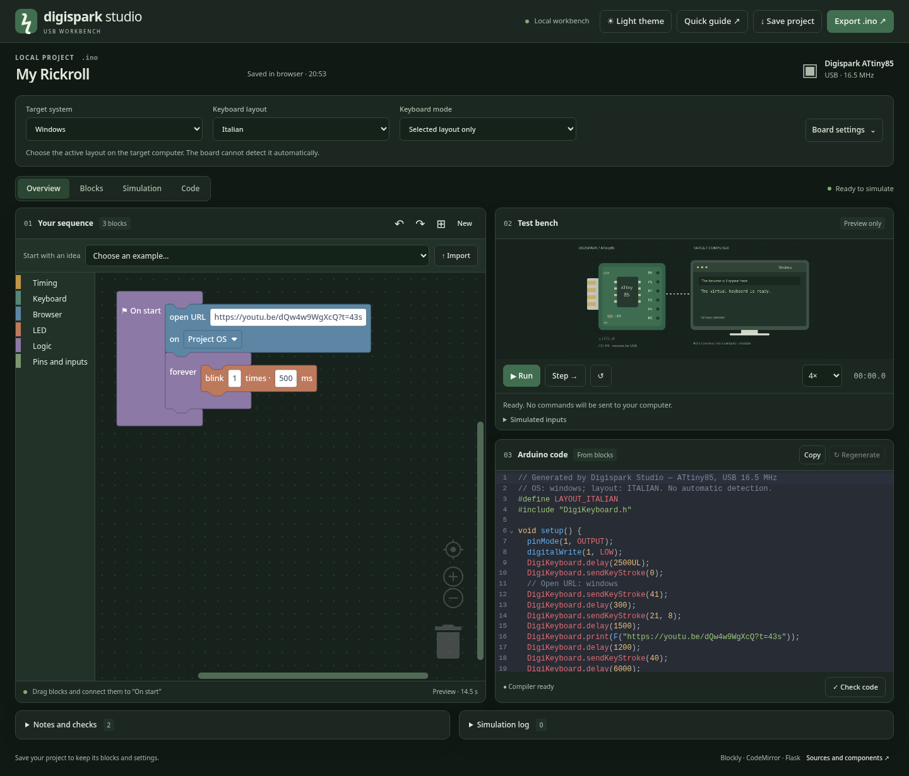

# Digispark Studio

A local Flask workbench for creating **Digispark ATtiny85 / DigiKeyboard** sketches with Scratch-style blocks, a C++ editor, and a Canvas 2D preview. The interface and documentation are in English. Frontend libraries are bundled locally; no CDN is required.



## Quick start

Python 3.10+ is enough to run the application. Node.js 22+ is only needed to modify and rebuild the frontend.

```bash
cd DigisparkStudio
python3 -m venv .venv
.venv/bin/python -m pip install -r requirements.txt
.venv/bin/python launch.py
```

On Windows, use `py -m venv .venv`, then `.\.venv\Scripts\python.exe` for the installation and launch commands. The launcher opens **http://127.0.0.1:5055** and starts Flask if needed.

The server is intended for local use and is not configured for Internet hosting. Blocks, simulation, and sketch export work without Arduino CLI; compilation is optional.

## Tutorial: installation and first upload

Follow these steps in order: **application → Arduino IDE → USB drivers → first upload**. Arduino CLI is only required to compile directly from the website.

### 1. Install Digispark Studio

Download and extract the project ZIP. Once the repository is published on GitHub, you can also use **Code → Download ZIP**. Open a terminal in the folder containing `app.py`, `launch.py`, and `requirements.txt`. Do not run the program inside the compressed archive. The folder may be called `DigisparkStudio` or the repository name followed by `-main`.

#### Windows — PowerShell

Install **Python 3.10 or later** from the [Python website](https://www.python.org/downloads/), then reopen PowerShell. From the project folder:

```powershell
py --version
py -m venv .venv
.\.venv\Scripts\python.exe -m pip install -r requirements.txt
.\.venv\Scripts\python.exe launch.py
```

If `py` is unavailable but `python --version` works, replace `py` with `python` in the first two lines. There is no need to activate the virtual environment or change PowerShell's execution policy.

#### Linux — Debian / Ubuntu and derivatives

Install the prerequisites, then run these commands from the project folder:

```bash
sudo apt update
sudo apt install python3 python3-venv python3-pip
python3 --version
python3 -m venv .venv
.venv/bin/python -m pip install -r requirements.txt
.venv/bin/python launch.py
```

On other distributions, use the distribution's package manager to install Python and `venv` support. Run Studio as your regular desktop user.

#### macOS — Terminal

Install **Python 3.10 or later** from the [Python website](https://www.python.org/downloads/macos/). From the project folder:

```bash
python3 --version
python3 -m venv .venv
.venv/bin/python -m pip install -r requirements.txt
.venv/bin/python launch.py
```

#### Open, restart, and stop the application

The launcher opens [Digispark Studio on localhost](http://127.0.0.1:5055). If the browser does not open, visit that address manually. For subsequent launches, repeat only the `launch.py` command; you do not need to reinstall dependencies each time.

The launcher leaves the server running in the background. Closing the browser tab does not stop it. To control shutdown from a terminal, run `app.py` instead and press **Ctrl+C** to stop it:

```bash
# Linux / macOS
.venv/bin/python app.py
```

```powershell
# Windows
.\.venv\Scripts\python.exe app.py
```

Run only one server on port 5055. Launcher logs are stored in `.cache/digispark-studio/server.log` under your home directory. Internet access is needed to download dependencies; normal use does not require Node.js.

### 2. Configure Arduino IDE for Digispark

Install Arduino IDE using the [official Windows, Linux, and macOS guide](https://docs.arduino.cc/software/ide-v2/tutorials/getting-started/ide-v2-downloading-and-installing/). These instructions target a **Digispark ATtiny85 with the Micronucleus bootloader**, not Digispark Pro or Tiny88. A “RoHS” marking alone does not identify the microcontroller.

1. Open **File → Preferences**; on macOS, look for **Settings / Preferences** in the Arduino IDE menu.
2. Add the following address to **Additional boards manager URLs**, keeping any URLs for other manufacturers:

   ```text
   https://raw.githubusercontent.com/ArminJo/DigistumpArduino/master/package_digistump_index.json
   ```

3. Open **Tools → Board → Boards Manager**, or use the boards icon in the sidebar.
4. Search for **Digistump AVR Boards**, select **1.7.5**, and click **Install**. This is the version used to verify Studio.
5. Select **Tools → Board → Digistump AVR Boards → Digispark**.
6. Under **Tools → Clock**, select **16.5 MHz - For V-USB**.

The index and installation procedure are documented in the [Digistump core repository](https://github.com/ArminJo/DigistumpArduino#installation). The core is no longer maintained. This guide uses the version compatible with Studio; other cores are not assumed to be interchangeable.

The complete board profile used by the application is:

```text
digistump:avr:digispark-tiny:clock=clock165
```

`DigiKeyboard.h` is included with the core; you do not need to install similarly named libraries from Library Manager. Micronucleus uploads do not require a serial COM port. If automatic board selection finds nothing, select the board manually under **Tools → Board**.

### 3. USB drivers and permissions

#### Windows

After installing the core, open this folder in File Explorer:

```text
%LOCALAPPDATA%\Arduino15\packages\digistump\tools\micronucleus
```

Open the installed version's folder, normally `2.6` for core 1.7.5. If it contains `Digistump_Drivers`, run `Install_Digistump_Drivers.bat` and accept the requested elevation. For alternative packages, follow the [core's driver instructions](https://github.com/ArminJo/DigistumpArduino#driver-installation). Micronucleus also documents its [Windows installer](https://github.com/micronucleus/micronucleus/tree/master/windows_driver_installer).

Watch **Device Manager** immediately after connecting the board: the bootloader device may appear for only a few seconds. The driver is for Micronucleus; DigiKeyboard firmware uses a USB HID keyboard. If an installer lets you choose a device, select the Digispark bootloader and avoid replacing the driver for your keyboard or another device.

#### Linux

No proprietary driver is required, but USB permissions must allow access. Micronucleus provides an [official udev rule](https://github.com/micronucleus/micronucleus/blob/master/commandline/49-micronucleus.rules). Download and inspect it before installing:

```bash
curl -fL https://raw.githubusercontent.com/micronucleus/micronucleus/master/commandline/49-micronucleus.rules -o /tmp/49-micronucleus.rules
cat /tmp/49-micronucleus.rules
sudo install -m 644 /tmp/49-micronucleus.rules /etc/udev/rules.d/49-micronucleus.rules
sudo udevadm control --reload-rules
```

Unplug and reconnect the board. The upstream rule allows local users to access the device; its comments explain how to restrict access to an owner or group. Do not run Arduino IDE with `sudo`. Adding your user to `dialout` alone does not resolve permissions for this USB bootloader.

#### macOS

Micronucleus does not require custom USB drivers on macOS; see the [upstream instructions](https://github.com/micronucleus/micronucleus#usage). The upload tool is installed with the core. The older tool bundled with this core may need adjustments on recent macOS versions or Apple Silicon; this combination has not been verified. If you see an architecture or executable startup error, retain the complete message and check the Micronucleus package before changing configuration.

### 4. First upload: test the LED

Start with Studio's **Blinking LED** example to check the connection. Set the LED pin under **Board settings**: normally **P1**, or **P0** on some variants.

1. Click **Export .ino** in Studio.
2. Open the file in Arduino IDE and accept creation of a folder with the same name as the sketch.
3. Check the **Digispark** board and **16.5 MHz - For V-USB** clock settings.
4. Click **Verify**, the checkmark at the top left. A `Sketch uses ...` report indicates successful compilation.
5. **Unplug the Digispark** before starting the upload.
6. Click **Upload**, the right-pointing arrow next to Verify, or select **Sketch → Upload**.
7. When `Please plug in the device` appears, connect the board within the displayed time limit. If it was already connected, unplug and reconnect it while the uploader is waiting.
8. Wait for the final upload-success message. The memory usage report alone does not confirm a USB transfer.

The bootloader normally listens at power-on, then starts the sketch. The uploader should therefore be waiting before you connect the board. See [Micronucleus operation](https://github.com/micronucleus/micronucleus#usage). A normal upload does not require **Burn Bootloader**.

After the LED test, create a keyboard sketch. Select the target computer's OS and active keyboard layout, such as **Windows + Italian**. These settings refer to the computer that will receive the keystrokes, which may differ from the programming computer. For your first text test, open a blank document on your computer before connecting the board.

### 5. Optional: compile from Studio with Arduino CLI

Skip this section if you use **Export .ino → Arduino IDE**. To enable **Check code** in Studio, install [Arduino CLI using the official documentation](https://docs.arduino.cc/arduino-cli/installation/) and make `arduino-cli` available in your `PATH`.

Check the installation and install the core if needed:

```bash
arduino-cli version
arduino-cli core update-index --additional-urls https://raw.githubusercontent.com/ArminJo/DigistumpArduino/master/package_digistump_index.json
arduino-cli core install digistump:avr@1.7.5 --additional-urls https://raw.githubusercontent.com/ArminJo/DigistumpArduino/master/package_digistump_index.json
arduino-cli core list
```

The last command should list `digistump:avr` version `1.7.5`. Studio automatically uses `~/.arduinoIDE/arduino-cli.yaml` when present. If IDE and CLI use different data directories, also pass `--config-file` and that file's path to the CLI commands. See [Compiler configuration](#compiler-configuration) for custom paths.

To specify an executable outside your `PATH`, set its location before starting the server:

```bash
# Linux / macOS: replace the example path
export ARDUINO_CLI="/path/to/arduino-cli"
.venv/bin/python app.py
```

```powershell
# Windows: replace the example path
$env:ARDUINO_CLI = "C:\path\to\arduino-cli.exe"
.\.venv\Scripts\python.exe app.py
```

If Studio is already running, stop the existing server before restarting it with these variables. Reload the page: it should display **Compiler ready**. **Check code** compiles the editor contents; **USB upload is performed in Arduino IDE**.

### 6. Troubleshooting

| Message or symptom                                  | What to check                                                                                                                               |
| --------------------------------------------------- | ------------------------------------------------------------------------------------------------------------------------------------------- |
| `Missing FQBN (Fully Qualified Board Name)`         | Manually select **Digispark** and **16.5 MHz - For V-USB**. If the board is missing, install the core from step 2.                          |
| `DigiKeyboard.h: No such file or directory`         | Check that Digistump core 1.7.5 and the correct board are selected.                                                                         |
| `Sketch uses ...` but the board does nothing        | Compilation is complete; also click **Upload** and wait for the transfer to finish.                                                         |
| `Please plug in the device`, followed by a timeout  | Connect after the prompt. Check Windows drivers or Linux permissions. Try another port, a USB 2.0 hub, or another data cable if applicable. |
| `Access denied` / `Permission denied` during upload | On Linux, install the udev rule and reconnect. On Windows, check the bootloader driver.                                                     |
| USB device not recognized / Linux error `-71`       | Check contacts, port, and connection; try another computer. This is not a sketch syntax error and may indicate a board USB problem.         |
| LED stays off after a successful upload             | Try P0 instead of P1 in Board settings, then export and upload again.                                                                       |
| Incorrect keyboard symbols                          | Match the project layout to the target computer's active layout. “Try all” repeats attempts; it does not detect the layout.                 |
| `Compiler setup required` in Studio                 | Check CLI and core as described in step 5. Hover over the status for the reason. Sketch export is still available.                          |
| `No module named flask`                             | Use the Python executable inside `.venv` and install `requirements.txt` with that same interpreter.                                         |
| Page unavailable                                    | Start `app.py` in a terminal and read the error. Check that the URL is `http://127.0.0.1:5055`.                                             |
| `Address already in use`                            | A process is already using port 5055. If it is Studio, open the existing page; otherwise stop the relevant process or configure `PORT`.     |

Installation procedures for other operating systems are documented, but this project's compilation checks were run on the local Linux computer. Selecting Windows/macOS/Linux in the generator does not certify physical upload on all three systems.

## Workflow

1. Choose the **Target system** and **Keyboard layout**. LED pin and startup delay are under **Board settings**.
2. Connect modules to **On start**. Load an example or build your own sequence.
3. **Run / Pause / Step / Reset** preview events on the virtual board and computer. Adjust playback speed and inspect highlighted blocks in the event log.
4. C++ updates from the blocks. Manual edits switch the editor to **Manually edited** and are preserved. **Regenerate** asks for confirmation before replacing them with block-generated code.
5. **Check code** compiles the current editor contents using Arduino CLI and reports actual memory usage and diagnostics. It does not upload firmware.
6. **Export .ino** downloads the editor contents. Open the sketch in Arduino IDE, select the board and clock, then upload as described above.
7. **Save project** downloads JSON containing blocks, settings, and manual code. **Import** restores it. Browser autosave is convenient but does not replace a downloaded backup.

## Module catalog

| Category  | Modules                                                                                                         |
| --------- | --------------------------------------------------------------------------------------------------------------- |
| Timing    | Delay in milliseconds, initial USB delay                                                                        |
| Keyboard  | Text, single keypress, held key, release all, Ctrl/Shift/Alt/Win-Cmd/AltGr combinations                         |
| Shortcuts | Copy, paste, cut, select all, undo, save, new tab, address bar, close tab, full screen; Ctrl/Command adaptation |
| Browser   | HTTP/HTTPS URL; project OS, Windows, Linux, macOS, or all three attempts in sequence                            |
| LED       | On/off, blink count and interval                                                                                |
| GPIO      | P0–P2 digital output, P0/P1 PWM, P0–P2 input conditions with optional pull-up                                   |
| Flow      | Repeat N times, forever, selected-OS branch, input branch, comment                                              |

Examples: Rickroll + LED, Hello world, Blinking LED, Button on P2, OS shortcuts, and All modules.

## Compatibility and limitations

- Verified profile: `digistump:avr:digispark-tiny:clock=clock165`, **Digistump AVR 1.7.5**, and its included DigiKeyboard library. Upstream marks the core as no longer maintained; Studio targets this existing installation.
- **15 verified compilable layouts**, including Italian and US English. Eight other layouts declared by the core (Canadian multilingual, European Portuguese, Danish, Finnish, Swedish, Norwegian, Icelandic, and Turkish) have broken upstream 1.7.5 tables and are shown as unavailable.
- The board cannot detect the computer's keyboard layout. Text supports the ASCII subset: accents, Unicode, and emoji are rejected with an explanation because this DigiKeyboard implementation processes bytes rather than UTF-8. Key blocks send physical HID positions; use text blocks for layout-dependent symbols. The English interface does not change your keyboard layout; Italian remains the initial layout for compatibility with existing projects.
- OS selection is a **project setting, not detection of the connected computer**. URL actions use Win+R on Windows, Alt+F2 with `xdg-open` on Linux, and Spotlight on macOS. Custom launchers, Spotlight settings, Mac keyboard layouts, and autoplay policies can change the result. “Try all” receives no success feedback and may interfere with open windows.
- Simulation describes blocks; it does not run commands on your computer, actually open URLs, or emulate ATtiny85/USB. Manually edited C++ is not interpreted. Infinite loops preview three iterations, with a 1,500-event limit; generated firmware retains its actual loops. Explicit delays are respected, while typing, keypresses, and GPIO actions use indicative preview timings.
- Simulated inputs are set manually. LED and GPIO actions share the chosen pin. P3/P4 are reserved for USB and P5 for reset, so they cannot be selected. The LED normally uses P1; some variants use P0. Mouse HID, MIDI, serial ports, specific sensors, and bootloader updates are not implemented.
- The core's HID report supports one key plus modifiers. Subsequent text or key actions replace a held-key report.
- Compilation checks firmware, not physical connectivity. A board USB error such as `-71` must be resolved separately.

## Compiler configuration

Studio looks for `ARDUINO_CLI`, then `arduino-cli` in `PATH`, then the executable inside a mounted Arduino IDE AppImage. It reads `~/.arduinoIDE/arduino-cli.yaml` if present. For other locations:

```bash
ARDUINO_CLI=/path/to/arduino-cli ARDUINO_CONFIG=/path/to/arduino-cli.yaml .venv/bin/python app.py
```

Run the server as the desktop user so it can access the AppImage mount. Cores are not installed or updated automatically. Compilations are serialized, limited to 90 seconds, and use isolated temporary folders. Project code is not interpolated into shell commands. The app accepts only local hosts and blocks cross-origin POST requests.

## Keyboard layout sweep and themes

Under **Keyboard mode**, select **Try all 15 layouts**. The firmware repeats the sequence for every mapping, starting with the selected layout. The pause between attempts is configurable. The chosen OS remains unchanged; use the URL block's **try all** option to attempt all three operating systems too. Studio neither changes the computer's layout nor detects which attempt worked.

Exported code includes all 15 ASCII tables in flash memory and a function that selects the typing layout at runtime. Text and URL blocks use the current attempt's mapping; physical HID keys and shortcuts remain unchanged. The sketch is a single file. A **Forever** block directly at the end of **On start** runs after all attempts, using the initial layout. Nested infinite loops are rejected because they prevent subsequent attempts. Simulation shows the active layout in its log and below the board.

`data/layout_maps.json` contains tables extracted from core 1.7.5 with the AVR compiler. `tools/extract_layouts.py` rebuilds them from a local installation. Provenance, hash, and license are retained in the JSON; the license is also included in sweep-mode sketches. **Check code** verifies the board's flash limit.

**Light theme / Dark theme** changes the interface, blocks, and 2D scene. The preference is stored separately from the project; the default is dark. Older projects retain single-layout mode. Saved project names, user text, and manual code are preserved as entered rather than translated.

## Interface

- **Overview** places blocks, simulation, and code side by side. **Blocks**, **Simulation**, and **Code** expand the selected tool.
- Mobile starts in Blocks view. **＋ Modules** toggles the toolbox to make room for the sequence.
- **Copy** copies the editor contents. A persistent notice identifies manual edits.
- Compatibility notes are collapsible. Errors open diagnostics and disable actions that require valid blocks.
- The browser stores the theme and project. Downloaded JSON preserves blocks, settings, and manual code.

## Development and verification

```bash
npm ci
npm run build
python3 -m unittest discover -s tests -v
# Playwright starts the server if needed:
npx playwright test
```

`frontend/app.js` implements Blockly modules, the editor, and the Canvas renderer. `generator.py` validates blocks, generates C++, and prepares events; `app.py` exposes the Flask API. The built `static/app.js` is included. Set `CHROMIUM_PATH` to use a local browser, or run `npx playwright install chromium`. `PYTHON` selects the test server interpreter and `BASE_URL` its address and port.

## Selected GitHub references

- [Blockly](https://github.com/RaspberryPiFoundation/blockly): interlocking blocks, toolbox, undo/redo, and serialization; direct dependency, Apache-2.0.
- [Ardublockly](https://github.com/carlosperate/ardublockly): reference for the blocks-to-Arduino workflow; no code copied.
- [CodeMirror](https://github.com/codemirror/dev): C++ editing, line numbers, search, undo, bracket matching, folding, and indentation; direct dependency, MIT.
- [DigistumpArduino](https://github.com/ArminJo/DigistumpArduino): DigiKeyboard function and layout compatibility.

JavaScript versions are locked in `package-lock.json`. See `THIRD_PARTY_NOTICES.md` and `static/licenses/`.

## Local verification

- 20 Python tests cover validation, escaping, layouts, OS/GPIO branches, limits, API behavior, request origins, and compiler availability.
- 15 Chromium browser tests cover blocks, simulation, preserved manual code, import/export, errors, GPIO, mobile views, autosave, themes, layout sweep, and copying code. Compilation is skipped when the required core is unavailable.
- The all-modules example compiles for each of the three selectable target operating systems.
- All 15 enabled layouts compile with the installed core. The optional `python tests/verify_layouts.py` script writes a local report excluded from Git and requires Arduino CLI plus the core.
- No physical board verification or USB upload has been performed by the application.

## Preparing for GitHub

Source files, licenses, the npm lockfile, the frontend bundle, and `.github/workflows/ci.yml` are included. `.gitignore` excludes virtual environments, installed dependencies, local credentials, logs, and test reports. The application does not create remote repositories.

After creating an empty GitHub repository, run these commands from the project folder:

```bash
git init -b main
git add .
git status
# After configuring your Git identity:
git commit -m "Initial Digispark Studio release"
git remote add origin YOUR_REPOSITORY_URL
git push -u origin main
```

These are instructions for the owner; the launcher does not execute them. For a clean transfer archive, run `python tools/package_release.py`. The ZIP excludes installed dependencies and local data.

See [CONTRIBUTING.md](CONTRIBUTING.md) for development checks and [THIRD_PARTY_NOTICES.md](THIRD_PARTY_NOTICES.md) for licenses. Original code uses the [MIT license](LICENSE); third-party components and derived tables retain their own licenses.
